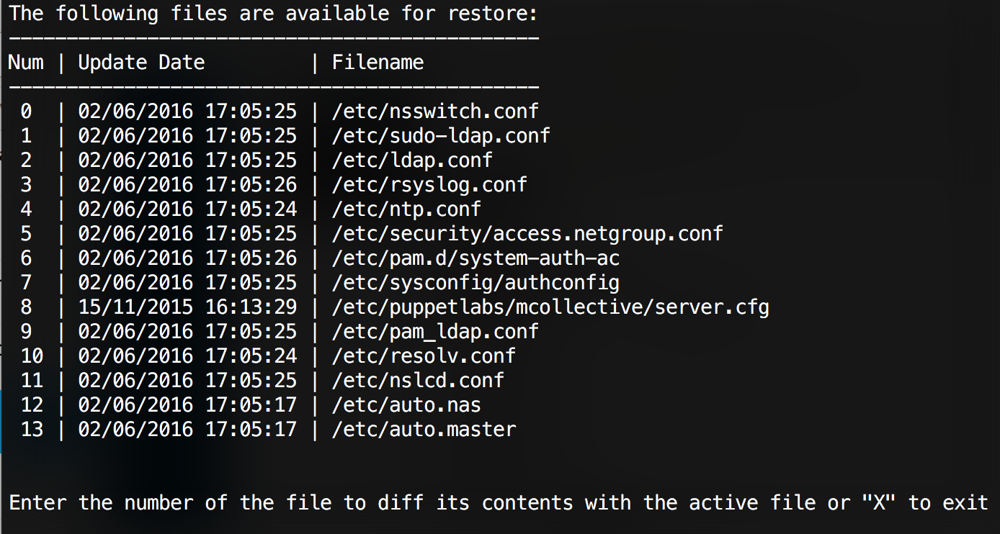
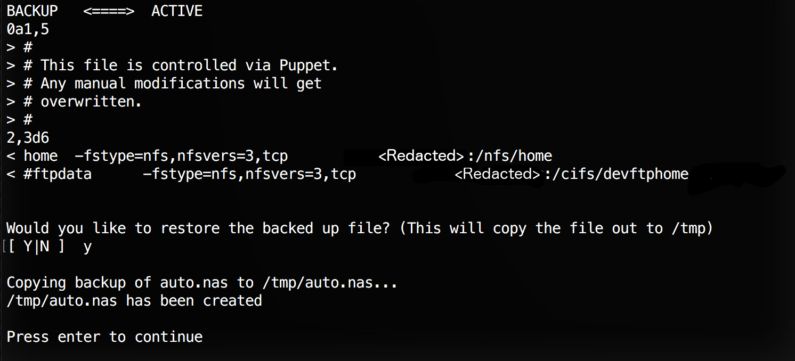

#<a name="top">PFRESTORE - A Puppet File Restore Utility</a>
---

A simple perl script (yes, there are a few of us graybeards that still find perl very useful) that provides a menu of files that Puppet has replaced on a given system.

Inspired by <a href="https://github.com/andytinycat">AndyTinyCat's</a> Ruby script: <a href="https://github.com/andytinycat/puppet-clientbucket-restore">puppet-clientbucket-restore</a>  

Requires:

1) POSIX 'strftime';

2) File::Copy qw(copy);

This has been tested on the following operating systems:

* Redhat Enterprise Linux 5.11  
* Redhat Enterprise Linux 6.5  
* Apple OSX 10.11.6

*If it works for you on another O/S or version, please let me know and I'll update this list.*

**<a name="pfrestore">pfrestore</a>**

The script must be run as root to be able to access the back up files.  

Puppet will back up files to a "clientbucket" location on the local filesystem (unless its been configured to use a central bucket, in which case, this script wont help you.  Sorry) in a nine level directory hierachy based on the MD5 sum of the file.  This makes it somewhat cumbersome to find a particular backup file that you may be looking for.   

**<a name="pfrestore">pfrestore</a>** solves this by scouring all of the backup directories and providing a simple menu for recovering those files.  The recovered files will get written to the /tmp directory so you dont need to worry about Puppet overwriting them again as soon as youve recovered them.  

* Initial listing of changed files that are available for restore

* Diffing the backed up file with the active file and prompting for the restore to the /tmp directory

[-top-](#top)

---

Last Updated: Mon Aug  8 18:27:26 CDT 2016
